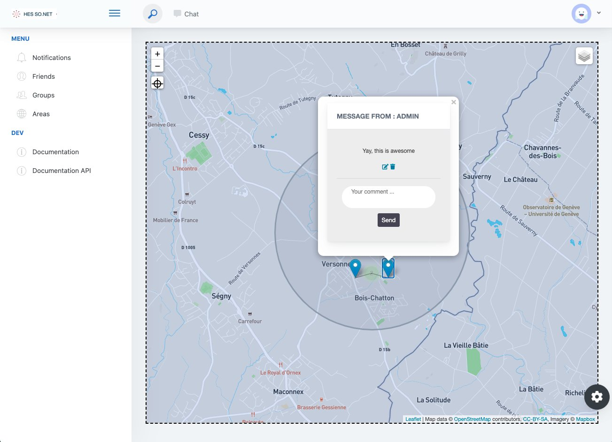

# HES-SO.NET

**Developed by:**  Maxime Hutinet, José Neto Gonçalves, Justin Foltz, Carina Inacio Oliviera, Guillaume Riondet

**Date:** 04.2020

## The project

HES-SO.NET is a social network allowing users to :

- post and view ephemeral messages at specific locations
- add friends and chat with them
- join specific group



## Technologies

The project has been built with different technologies :

- Django for the API REST, HTTP server and Websocket server
- HTML/CSS, JavaScript/JQuery, Bootstrap for the website
- RabbitMQ for the notification system
- PostgresSQL for the database

## How to run the project ?

### Requirements

To run the project, the followings must be installed on the machine :

- Docker
- Docker-compose

### Running the project

1. Clone the repository
2. Run Docker Compose with the following command

```
docker-compose up -d
```

1. Open a browser and navigate to `http://localhost:8001/admin/`
2. Log in with the following credentials :

```
username` : `admin
password` : `admin
```

1. Navigate to Backend > Visibilitys
2. Add the three following visibilities in order :

- Public
- Semi Private
- Private

1. You can now sign up to the website by navigating to `http://localhost:8001/signup`

### Destroying the environment

1. Run :

```
docker-compose down
```